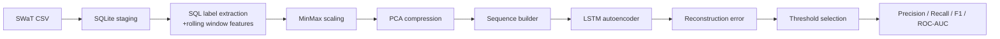

# SWaT LSTM Autoencoder for Industrial Anomaly Detection

An anomaly detection pipeline for the Secure Water Treatment (SWaT) dataset using SQL feature engineering, PCA compression, and an LSTM autoencoder. The project learns normal sensor and actuator behavior from multivariate time-series data and flags suspicious activity through reconstruction-error thresholding.

## Why This Project Matters

Industrial control systems generate high-dimensional time-series data that is hard to monitor manually. This project is relevant for real-world monitoring because it combines:

- sequence modeling for temporal behavior,
- dimensionality reduction to keep training practical,
- unsupervised anomaly detection when labeled attacks are limited,
- SQL-based feature staging that makes the preprocessing pipeline explicit and reproducible.

That makes it a solid resume project for machine learning, time-series analytics, anomaly detection, and industrial data systems roles.

## Architecture



## What It Does

1. Loads the SWaT dataset.
2. Maps `State` to binary labels: `Normal = 0`, `Attack = 1`.
3. Uses SQLite and SQL window functions to stage the dataset and engineer rolling features.
4. Scales sensor features with `MinMaxScaler`.
5. Reduces feature dimensionality with PCA.
6. Builds fixed-length sequences for LSTM input.
7. Trains an LSTM autoencoder on the sequence data.
8. Uses reconstruction error to detect anomalies.
9. Chooses a threshold by maximizing F1 score.
10. Reports precision, recall, F1, ROC-AUC, and visualization plots.

## Model Overview

- **Input**: Multivariate time-series windows from SWaT.
- **SQL layer**: SQLite staging, label extraction, and rolling mean feature engineering.
- **Preprocessing**: MinMax scaling + PCA compression.
- **Sequence length**: 30 timesteps.
- **Model**: LSTM autoencoder.
- **Loss**: Mean squared error reconstruction loss.
- **Decision rule**: `reconstruction_error > threshold`.

The notebook snapshot shows an optimal threshold around **0.0294** in the saved plots.

## Repository Contents

- `train_swat_autoencoder.py` - reusable training script that saves metrics and plots.
- `model.ipynb` - notebook prototype with preprocessing, training, evaluation, and plots.
- `SWaT_Dataset.csv` - local dataset file expected at runtime, not tracked in git.
- `lstm_autoencoder*.pth` - local saved model checkpoints, not tracked in git.
- `artifacts/` - generated plots, metrics, and SQL profiling outputs from the training script.
- `requirements.txt` - Python dependencies.

## Getting Started

### 1. Create an environment

```bash
python -m venv .venv
source .venv/bin/activate
```

### 2. Install dependencies

```bash
pip install -r requirements.txt
```

### 3. Run the notebook

```bash
jupyter lab model.ipynb
```

Run the notebook cells from top to bottom to reproduce preprocessing, training, and anomaly scoring.

Before running, place `SWaT_Dataset.csv` in the project root. The dataset and trained weights are intentionally excluded from version control so the repository stays lightweight and pushable.

### 4. Run the script version

```bash
python train_swat_autoencoder.py
```

This creates a checkpoint plus reproducible outputs in `artifacts/`:

- `metrics.json`
- `sql_feature_profile.csv`
- `reconstruction_error.png`
- `error_histogram.png`
- `precision_recall_curve.png`
- `roc_curve.png`

## Results

Use this table to paste in verified numbers from a clean run:

| Metric | Value |
| --- | --- |
| Precision | 99.57% |
| Recall | TODO |
| F1 Score | TODO |
| ROC-AUC | TODO |
| Best Threshold | TODO |

## Data Notes

- The notebook expects `SWaT_Dataset.csv` in the project root.
- The code drops the timestamp column and uses `State` for evaluation labels.
- If your dataset schema differs, update the preprocessing step before running.

## Suggested Resume Framing

Use a description like this:

> Built an unsupervised anomaly detection pipeline for industrial control system telemetry using SQLite/SQL feature engineering, PCA-compressed LSTM autoencoder modeling, and reconstruction-error thresholding on the SWaT dataset. Implemented sequence modeling and evaluation with precision, recall, F1, and ROC-AUC, with reproducible metrics and plots saved to disk.

## Future Improvements

- Move the notebook logic into a reusable training script.
- Add a small CLI for training and inference.
- Log experiments and metrics to a JSON or CSV report.
- Add tests for preprocessing and threshold selection.
- Compare against alternative detectors such as isolation forest or one-class SVM.